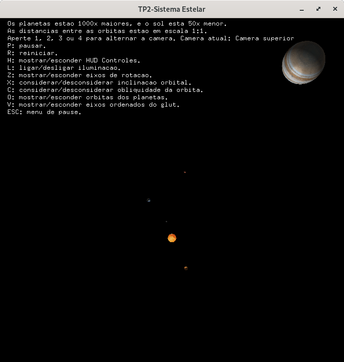
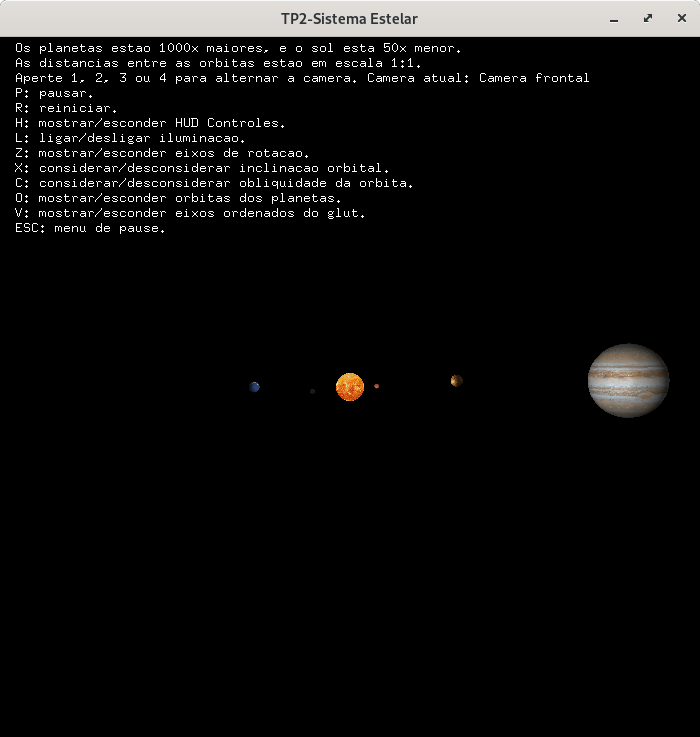
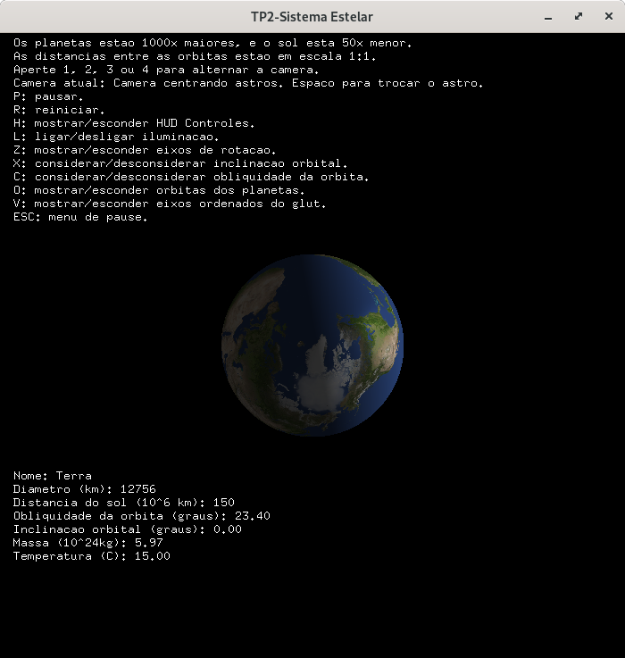

# TP2-Computacão Gráfica / Sistema Solar OpenGL

Esse trabalho foi desenvolvido no âmbito da disciplina Computação Gráfica 2021.1 pelos integrantes:
- Abdul Kevin Alexis
- Caio Vínicius

Bibliotecas necessárias
=======================================
glew, freeglut, SOIL
-------------------------------------

- Instalação freeglut:
>`sudo apt-get install freeglut3 freeglut3-dev`

- Instalação GLEW:
>`sudo apt-get install libglew-dev`

- Instalação SOIL:
>`sudo apt-get install libsoil-dev`

Instruções para a compilação e execução
=======================================
1. Para compilar  jogo, deve  entrar no terminal. Dentro do diretorio,dá o comando *make*.
>**~/../tp2-Computacao-Grafica$** `make`
2. Depois da compilação, roda o arquivo executável que foi criado fazendo 
>**~/../tp2-Computacao-Grafica$** `./main`

*Atenção: No meu menu da simulação, encontra-se as intruções para ativar os comandos.*

Lista de itens adicionais implementados no jogo
===============================================

- Modo de órbitas visíveis (6%)
- Tour entre os objetos (8%)
- Fidedignidade (10%)

Screenshot da Simulação
==================

Desmostração em Video
=====================

  
[Clique aqui para assistir o vídeo][6]

# Referência
- [Informações sobre as planetas][1]
- [Texturas das Planetas][2]

[1]: <https://nssdc.gsfc.nasa.gov/planetary/factsheet/> (Info) 
[2]: <https://www.solarsystemscope.com/textures/> (Texturas) 

[6]: <https://youtu.be/w9ELCg7dJHo> (Demostração)